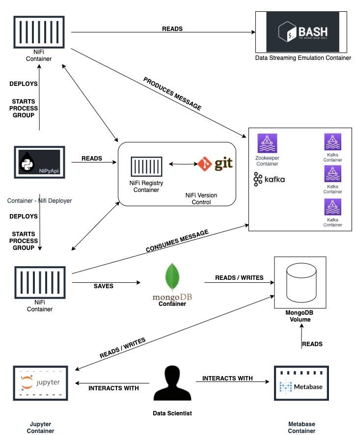

# POC - Speed Layer - Open Banking

#### Avisos
- **Todos os comandos demonstrados devem ser executados no diretório raiz do projeto;**
- Esta documentação não suporta Windows, apesar de a POC, em si, suportá-lo;

## Visão Geral da Arquitetura

## Pré-requisitos para a execução

 1. **Git**.
 2. **Docker**.
 3. **Docker Compose**.

## Configuração

1 -  Certifique-se de possuir chaves SSH **(SEM SENHA)** configuradas em sua máquina;

2 - Clone **este** repositório;

3 - Dê permissão de execução aos scripts:

`chmod +x *.sh`

## Execução
### Toda a execução desta poc é feita através do script: `./cli.sh`

### Opções:
**1 - Setup Environment**

(PRÉ-REQUISITO PARA A CORRETA EXECUÇÃO DA APLICAÇÃO)
- Permite a configuração de campos necessários no docker-compose.yml automaticamente;

**2 - Start**
- **A primeira execução pode durar vários minutos;**
- Inicia todos os contêineres;
- Faz deploy de todos os process groups nas instâncias de Apache NiFi;
- Inicia todos os process groups de todas as instâncias;
- Inicia a simulação do streaming;

**3 - Application Status**
- Permite visualizar o status de toda a aplicação;

**4 - Tail Streaming**
- Permite acompanhar em tempo real as linhas geradas pelo simulador de streaming;
- Para sair: CTRL-C. Esta ação faz sair do cli.sh. Basta abri-lo novamente;

**5 - Open MongoDB Conteiner**
- Acessa o contêiner do MongoDB;
- Para sair do contêiner: CTRL-D;

**6 - Remove all Containers**
- Destrói todos os contêineres;
- Os dados persistidos pelo MongoDB são mantidos;

**7 - Remove all Persisted Data**
- Remove os dados persistidos pelo MongoDB;
- Remove os arquivos gerados para simular o streaming de dados;
 
## MongoDB
Após os dados serem processados pelo Apache NiFi, eles são inseridos no database **raw**, na collection **adults**.

### Uma vez dentro do contêiner do MongoDB (Veja acima), execute:
    mongo
    use raw
    db.adults.find().pretty()

Para verificar a quantidade de registros inseridos:

`db.adults.count()`

- Para sair do MongoDB: **CTRL-D**;

## Metabase
Utilize-o para verificar os registros, conforme são inseridos:

**URL**
`http://localhost:4000`

**Credenciais**
- E-mail: `fiap@fiap.com`
- Password: `fiap2021`

## Jupyter
Para manipular, com Python, os dados persistidos no MongoDB, acesse:

`http://localhost:8888`

**Há um Notebook criado com uma conexão ao banco de dados.**
