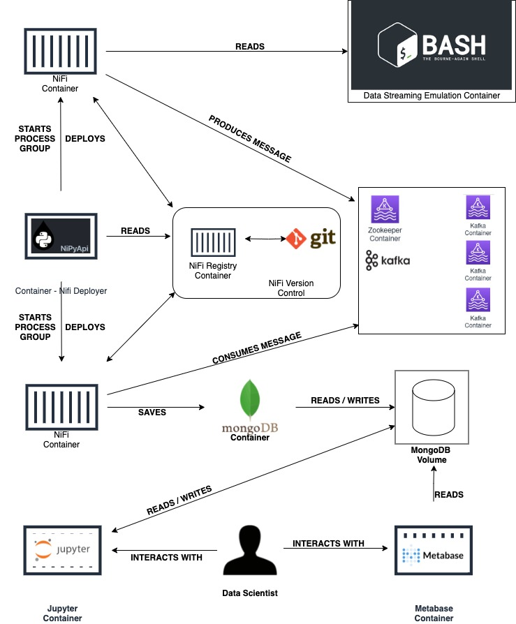

# POC - Speed Layer - Open Banking

#### Aviso: Esta documentação não suporta Windows, apesar de a POC, em si, suportá-lo.

## Visão Geral da Arquitetura

## Software Necessário

 1. **Git** instalado e configurado adequadamente.
 2. **Docker**.
 3. **Docker Compose**.

## Configuração

1 -  Certifique-se te possuir sua chave SSH configurada em sua conta do Git. *Para mais informações: https://tinyurl.com/3tw839jj*

 - Não utilize senhas durante a criação da chave SSH!
 
2 - Clone **este** repositório. *Para mais informações: https://tinyurl.com/6bhk89tz*

3 - Configuração do docker-compose.yml:

- Dê permissão de execução aos scripts:
`chmod +x *.sh`

- Execute o script e responda a cada pergunta com seus dados:
`./poc-setup-unix.sh`

## Execução

1 - Em um terminal, abra o diretório raiz do projeto.

2 - Execute: `./poc-start-unix.sh` .  *A primeira execução deste comando pode levar vários minutos.*

 - O simulação do streaming de dados deve iniciar dentro de 2 minutos após a inicialização dos contêineres.
 
 ## Acesso ao mongo
    ./poc-open-mongo.sh

    use raw

    db.adults.find().pretty()

Para verificar a quantidade de registros inseridos:

`db.adults.count()`

## Metabase

Verifique que os registros da simulação de streaming estão sendo/foram inseridos.

- Para verificar os registros através do Metabase:

`http://localhost:4000`

- Dados de acesso:

Email address: `fiap@fiap.com`

Password: `fiap2021`

## Jupyter

- Para manipulação dos dados inseridos, poderá ser utilizado o jupyter em python ou R, acessando:

`http://localhost:8888`

**Já há um notebook criado com conexão de teste ao banco no MongoDB**

## Encerrar
Há diversas maneiras de parar os contêineres. Rode algum dos seguintes comandos no diretório raiz do projeto: 

1 - Para os contêineres e os destrói: (Com exceção dos dados do MongoDB, todos os dados serão perdidos.)

`./poc-rm-containers-unix.sh`

2- Para deletar todos os dados persistidos pelo MongoDB e Output Streaming:
`./poc-rm-persisted-data-unix.sh`

